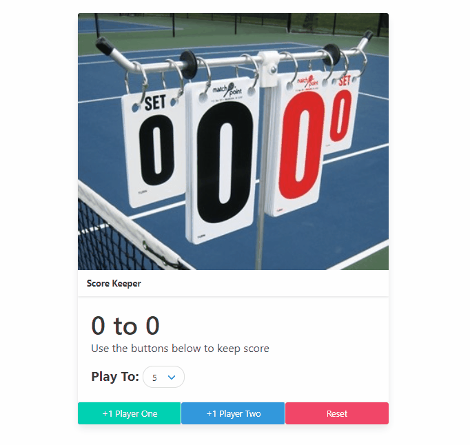

# Web Developer Bootcamp 2021 Course

This repo will contain all web application/projects built while following the Web Developer Bootcamp.

---

## Project 1

### Score Keeper

This project utilizes HTML, CSS & Javascrript. This small project is a simple score keeper application that uses a new CSS framework Bulma.

